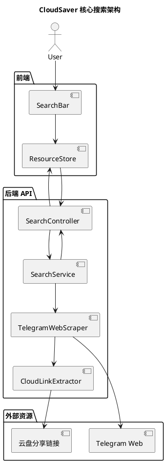
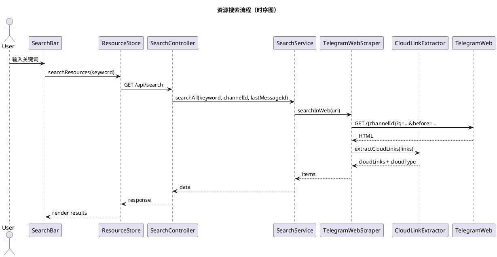

# CloudSaver 核心功能与实现细节架构文档（中文）

> 目标：本文件在脱离上下文时，仍可作为 Java + Spring Boot 重构与二次开发的完整依据。
> 图示优先使用 PlantUML（PUML）。

---

## 1. 系统功能总览（现有核心功能）

1. 资源搜索（Telegram 频道抓取 + 云盘链接提取）
2. 资源结果展示与分页加载更多
3. 云盘资源解析与转存（115 / 夸克）
4. 云盘链接识别与分类（支持多云盘）
5. 豆瓣热榜与搜索
6. 用户登录/注册
7. 系统设置（代理/全局配置）
8. Telegram 图片展示
9. 赞助列表展示

> 功能来源：后端路由与前端 store 行为共同构成核心能力。

---

## 2. 资源搜索（核心逻辑）

### 2.1 请求入口与路由

- 前端：`resourceStore.searchResources()` 调用 `/api/search`。
- 后端：`/api/search` 路由分发到 `ResourceController.search()`。

### 2.2 后端搜索执行流程（Searcher.searchAll）

核心步骤：
1. 选择搜索频道（传入 `channelId` 则单频道，否则全部频道）。
2. 构造 Telegram Web 搜索 URL。
3. 并发抓取各频道 HTML。
4. 解析 HTML，提取消息字段与云盘链接。
5. 仅保留包含云盘链接的消息条目。
6. 按频道聚合并返回。

---

## 3. 搜索 URL 规则与分页加载更多

Telegram Web 搜索 URL 形态：

```
/{channelId}?q={keyword}&before={messageId}
```

- `q`：关键词搜索
- `before`：时间向前翻页（实现“加载更多”）

前端分页机制：
- 当点击“加载更多”，取该频道最后一条 `messageId` 作为 `lastMessageId`。
- 后端拼接 `before=lastMessageId` 继续抓取。

---

## 4. HTML 解析与字段抽取（Searcher.searchInWeb）

解析目标：Telegram Web 页面 HTML。

提取字段（每条消息）：
- `messageId`
- `title`
- `content`
- `pubDate`
- `image`
- `tags`
- `cloudLinks`
- `cloudType`

云盘链接抽取：
- 使用配置中的 `cloudPatterns` 正则匹配链接文本。
- 去重并识别云盘类型。

---

## 5. 搜索结果结构

后端返回结构：

```json
{
  "data": [
    {
      "id": "channel_id",
      "channelInfo": { "name": "频道名", "channelLogo": "..." },
      "list": [
        {
          "messageId": "...",
          "title": "...",
          "content": "...",
          "pubDate": "...",
          "image": "...",
          "cloudLinks": ["..."],
          "cloudType": "...",
          "tags": ["#tag1", "#tag2"]
        }
      ]
    }
  ]
}
```

---

## 6. 云盘解析与转存

前端通过 `CLOUD_DRIVES` 配置定义：
- 云盘类型
- 解析正则
- API 调用（获取分享信息 / 执行转存）

支持类型：
- 115 网盘
- 夸克网盘

流程：
1. 使用正则识别云盘链接类型
2. 解析分享码与提取码
3. 调用云盘 API 获取分享信息
4. 发起转存

---

## 7. 其他核心功能

### 7.1 豆瓣热榜与搜索
- 后端接口：`/api/douban/hot`
- 前端页面：Douban 页面提供搜索入口

### 7.2 用户登录/注册
- `/api/user/login`
- `/api/user/register`

### 7.3 设置与代理
- `/api/setting/get`
- `/api/setting/save`

### 7.4 Telegram 图片
- `/api/tele-images`

### 7.5 赞助列表
- `/api/sponsors`

---

## 8. Java + Spring Boot 重构建议

### 8.1 分层架构

- Controller：`SearchController`
- Service：`SearchService`
- Scraper/Parser：`TelegramWebScraper`
- Extractor：`CloudLinkExtractor`

### 8.2 并发抓取

- 使用 `CompletableFuture` 并发抓取多个频道
- 单频道失败不影响整体结果

### 8.3 配置项

- `telegram.baseUrl`
- `telegram.channels`
- `cloudPatterns`

---

## 9. 数据模型（建议）

```java
class Channel {
  String id;
  String name;
}

class ResourceItem {
  String messageId;
  String title;
  String content;
  String pubDate;
  String image;
  List<String> cloudLinks;
  String cloudType;
  List<String> tags;
}

class ChannelResult {
  String id;
  ChannelInfo channelInfo;
  List<ResourceItem> list;
}

class SearchResponse {
  List<ChannelResult> data;
}
```

---

## 10. 架构图（PUML）



---

## 11. 流程序列图（PUML）



---

## 12. 迁移与二开扩展点

1. 新增搜索源：扩展 `telegram.channels`
2. 新增云盘类型：扩展 `cloudPatterns`
3. 增强字段解析：扩展 HTML 解析逻辑
4. 增加缓存/索引：引入数据库与定时抓取
5. 强化权限：增加用户与权限模型

---

## 13. 结论

当前系统核心能力以 Telegram Web 抓取为基础，通过 HTML 解析与云盘链接识别形成“资源搜索”的主干逻辑。此文档已抽象出完整的接口、数据结构、流程与扩展点，足以在 Java + Spring Boot 环境中进行完整重构并支持后续二次开发。
